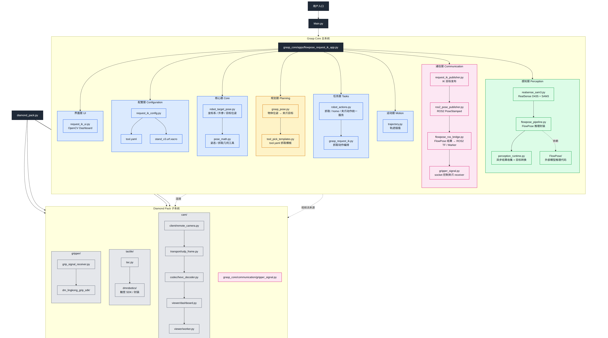

# Daimon Stuff

本仓库收集了 Daimon 夹爪、远程相机和触觉检测相关的 Python 工具。这个目录主要用于本地调试、双夹爪控制、双相机预览，以及触觉/滑移检测实验。


## 目录结构

| 路径 | 说明 |
|---|---|
| `dm_gripper_py/` | 夹爪控制 SDK 与基础测试脚本 |
| `dm_gripper_cam_py/` | 远程鱼眼相机客户端、双相机查看器和 gRPC/UDP 视频流逻辑 |
| `dm_gripper_tac_py/` | 触觉感知、力估计、滑移检测和 TensorRT/CUDA 推理相关工具 |
| `examples/` | 可直接运行的示例入口，包含相机、触觉、夹爪和整合 dashboard |

## Conda 环境配置

推荐从项目根目录创建独立 conda 环境。默认环境覆盖夹爪 SDK、远程相机客户端和触觉 CPU/基础流程：

```bash
conda env create -f environment.yml
conda activate daimon-gripper
```

如果环境已经存在，需要按当前文件更新：

```bash
conda env update -f environment.yml --prune
conda activate daimon-gripper
```

安装完成后做基础导入检查：

```bash
python -c "import grpc, cv2, numpy, dm_lingkong_grip_sdk, dmrobotics; print('daimon-gripper env ok')"
```

如果只想手动用 pip 安装，也可以在已激活的环境中执行：

```bash
python -m pip install -r requirement.txt
python -m pip install -e dm_gripper_py
python -m pip install -e dm_gripper_tac_py
```

## GPU/TensorRT 触觉环境

触觉 GPU 推理需要 NVIDIA driver、CUDA、cuDNN 和 TensorRT 版本匹配。仓库提供了单独的 GPU 环境文件：

```bash
cd dm_gripper_tac_py
conda env create -f environment-gpu.yml
conda activate daimon-gripper-gpu
python -m pip install .
python -m pip install ".[gpu]"
dmrobotics trt build
```

如果 GPU 环境已经存在：

```bash
cd dm_gripper_tac_py
conda env update -f environment-gpu.yml --prune
conda activate daimon-gripper-gpu
python -m pip install .
python -m pip install ".[gpu]"
dmrobotics trt build
```

如果 TensorRT 运行时报动态库找不到，可在激活环境后临时补充库路径：

```bash
export LD_LIBRARY_PATH="$CONDA_PREFIX/lib/python3.10/site-packages/tensorrt_libs:$CONDA_PREFIX/lib/python3.10/site-packages/nvidia/cuda_runtime/lib:$CONDA_PREFIX/lib:${LD_LIBRARY_PATH:-}"
```

GPU 依赖细节见 `dm_gripper_tac_py/requirements-gpu.txt` 和 `dm_gripper_tac_py/README.md`。

## 依赖文件说明

| 文件 | 覆盖范围 |
|---|---|
| `environment.yml` | 推荐的 conda 基础环境，安装夹爪 SDK 和触觉基础包 |
| `requirement.txt` | 夹爪、相机和触觉 CPU/基础流程的常用依赖 |
| `dm_gripper_py/requirement.txt` | 夹爪 SDK 的 gRPC/protobuf 依赖 |
| `dm_gripper_cam_py/requirements.txt` | 相机客户端依赖，包含 `numpy`、`opencv-python` 等 |
| `dm_gripper_tac_py/setup.py` | 触觉模块 CPU/基础依赖 |
| `dm_gripper_tac_py/environment-gpu.yml` | 触觉 GPU/TensorRT 专用 conda 环境 |
| `dm_gripper_tac_py/requirements-gpu.txt` | 触觉 GPU 环境的固定 pip 依赖 |

## 示例脚本

所有示例都从项目根目录运行。更多说明见 `examples/README.md`。

| 示例 | 用途 | 命令 |
|---|---|---|
| 双目相机预览 | 查看左右远程相机，脚本顶部可配置 IP、视频大小和帧率 | `python examples/dual_camera_viewer.py` |
| 双手整合 dashboard | 双相机、触觉和双夹爪整合显示/控制，底部有左右两条独立连续位置 bar | `python examples/daimond_pack_dual.py` |
| 单手整合 dashboard | 单手相机、触觉和夹爪整合显示/控制，底部是连续夹爪位置 bar | `python examples/daimond_pack_single.py` |
| 单手夹爪控制 | 直接连接 SDK 控制一只夹爪，连续位置 bar | `python examples/gripper_single_control.py` |
| 双手夹爪控制 | 直接连接 SDK 分别控制左右夹爪，左右分开的连续位置 bar | `python examples/gripper_dual_control.py` |
| 触觉 dashboard | 触觉显示兼容入口 | `python examples/tac.py` |

## 远程夹爪 Server/GUI

如果只需要远程控制夹爪，不启动 ROS 或相机，可以先在连接夹爪 CAN/gRPC 的机器上启动 server：

```bash
python gripper_server.py --host 0.0.0.0 --port 8020 \
  --left-gripper 192.168.14.11:55551 \
  --right-gripper 192.168.14.10:55551
```

然后在控制端启动 GUI client：

```bash
python gripper_gui_client.py --server-url http://SERVER_IP:8020
```

通信接口和 `vlahost` 保持同类结构：`GET /state` 获取快照，`POST /command` 发送低频命令，`/ws/state` 推送状态，`/ws/command` 连续发送控制命令。命令 JSON 示例：

```json
{"side":"all","position":1000,"speed":50,"torque":50}
```

`position` 范围是 `0..1000`，其中 `0=闭合`，`1000=张开`。GUI 支持拖动左右滑条，快捷键 `L` 闭合、`P` 张开、`Q`/`Esc` 退出。

默认会通过 `8021` 和 `8022` 启动左右夹爪相机图像服务：

```bash
python gripper_server.py --host 0.0.0.0 --port 8020 \
  --left-gripper 192.168.14.11:55551 \
  --right-gripper 192.168.14.10:55551 \
  --left-camera-host 192.168.14.10 \
  --right-camera-host 192.168.14.11
```

图像接口是 `http://SERVER_IP:8021/video` 和 `http://SERVER_IP:8022/video`。查看端运行：

```bash
python img_client.py --host SERVER_IP
```

如果不需要图像服务，启动 server 时加 `--disable-image-streams`。

## 常用命令

单手整合 dashboard 通过 `--ip` 选择整只单手设备；相机、触觉和夹爪默认都使用这个 IP，夹爪地址自动是 `IP:55551`：

```bash
python examples/daimond_pack_single.py --ip 192.168.14.10
python examples/daimond_pack_single.py --ip 192.168.14.11
```

夹爪基础测试：

```bash
python dm_gripper_py/test_grip.py
```

双夹爪交互控制：

```bash
python dm_gripper_py/dual_interactive_position.py
```

相机默认地址：

| 设备 | 地址 |
|---|---|
| 左手 | `192.168.14.10` |
| 右手 | `192.168.14.11` |

## 相机链路

```text
examples/dual_camera_viewer.py
  -> dm_gripper_cam_py/dual_camera_viewer.py
  -> dm_gripper_cam_py/remote_camera.py
  -> dm_gripper_cam_py/camera_proxy* + udp_frame.py + hevc_ffmpeg_decoder.py
```

`examples/dual_camera_viewer.py` 是可直接运行的示例入口。核心参数、后台读取 worker 和显示循环在 `dm_gripper_cam_py/dual_camera_viewer.py`，远程连接和视频流读取在 `dm_gripper_cam_py/remote_camera.py`。

双目相机脚本默认配置在 `examples/dual_camera_viewer.py` 顶部：

```python
LEFT_IP = "192.168.14.10"
RIGHT_IP = "192.168.14.11"
VIDEO_SIZE = (1280, 720)
FPS = 60
```

也可以临时用命令行覆盖：

```bash
python examples/dual_camera_viewer.py --left-ip 192.168.14.10 --right-ip 192.168.14.11 --video-size 1280x720 --fps 60
```

## 调参入口

夹爪闭合行为常用参数包括：

| 参数 | 作用 | 建议 |
|---|---|---|
| `--speed 50` | 移动速度 | SDK 原生范围 `10-100` |
| `--torque 50` | 最大力矩 | SDK 原生范围 `10-100` |
| `--hold-torque 10` | 接触后的保持力 | 默认保持 `10` 即可，避免持续加大压力 |
| `--min-pos 0` | 位置 bar 下限 | SDK 原生位置：`0=闭合` |
| `--max-pos 1000` | 位置 bar 上限 | SDK 原生位置：`1000=张开` |
| `--current-threshold 120` | 电流停止阈值 | 主要依靠位置停滞检测判断接触，该参数保持默认即可 |
| `--poll-interval 0.05` | 状态检测周期，单位秒 | 越小响应越快，推荐范围 `0.03-0.08` |
| `--contact-grace 0.4` | 接触检测延迟时间 | 忽略启动阶段无运动状态，避免误判。速度较慢时可增加到 `0.6` |
| `--progress-epsilon 2` | 最小运动距离阈值 | 误停止时降低到 `1`；停止过晚时增加到 `3-5` |
| `--stall-samples 5` | 停滞检测次数 | 响应慢改为 `3`；误停止改为 `6-8` |

## 注意事项

- 运行前确认夹爪和相机 IP 与脚本配置一致。
- 远程相机依赖 OpenCV、gRPC 和视频解码环境。
- GPU 触觉推理需要 NVIDIA driver、CUDA、cuDNN 和 TensorRT 环境匹配。
- 子目录中各自保留了更详细的安装与测试说明。
